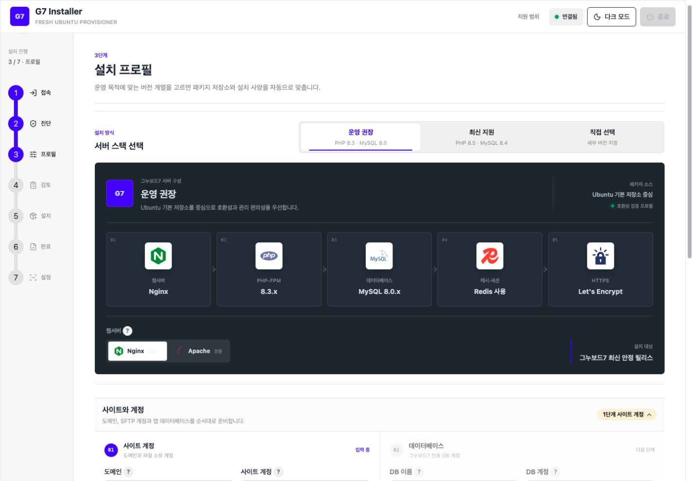
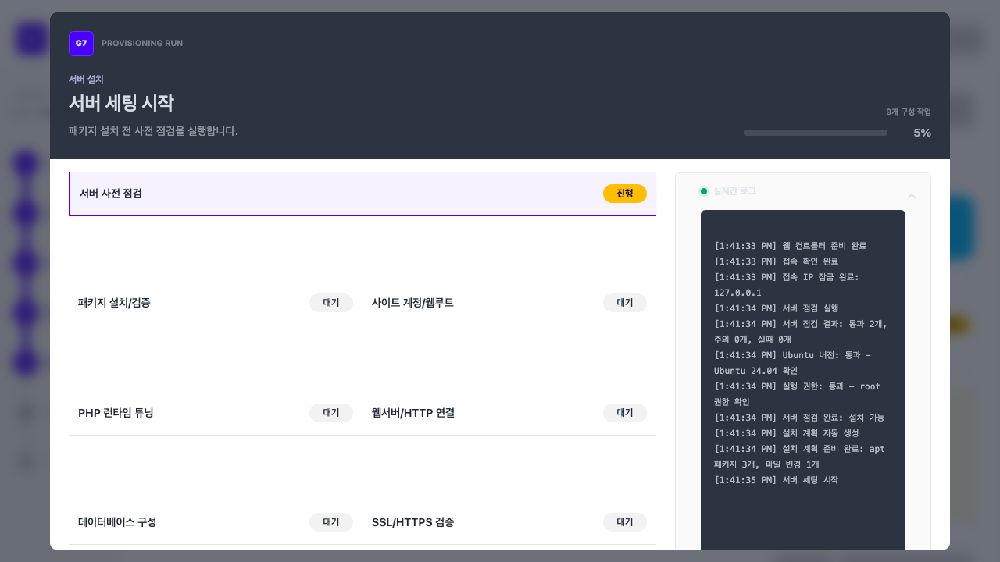

# G7 Installer

Ubuntu VPS에 `g7inst`를 설치하고 웹 마법사로 그누보드7용 서버 구성과 사이트 프로비저닝을 진행하는 도구입니다.

> 현재 공개 릴리스는 `v0.3.0-beta.15` Public Beta입니다. 새 Ubuntu 22.04 이상 VPS에서 `g7inst` 설치, 서버 점검, 웹 마법사, apt 패키지 설치, Nginx/Apache 도메인 연결 설정(vhost), PHP/DB 사양 튜닝, DB 앱 계정 생성, Let's Encrypt 인증서 발급/갱신 검증, 그누보드7 브라우저 설치 화면 준비, G7 런타임 마무리와 설치 안내서까지 검증합니다.

`completed`는 **서버 프로비저닝 완료**를 뜻합니다. 결과 리포트의 앱 링크에서 G7 공식 브라우저 설치를 마친 뒤 설치 안내서의 `G7 런타임 설정 적용`을 실행해야 Redis 캐시·세션·큐, 스케줄러, Reverb와 실효 설정 검증까지 완료됩니다.

## 설치 마법사 화면

운영 권장·최신 지원 프로필을 고르면 웹서버, PHP, MySQL, Redis, SSL 구성이 한 화면에서 동기화됩니다.



설치 중에는 단계별 상태와 실제 명령 로그를 같은 화면에서 확인할 수 있습니다.



## 무엇부터 보면 되나요?

| 상황 | 문서 |
| --- | --- |
| Mac/Windows에서 명령만 따라 설치 | [따라하기식 설치 매뉴얼](docs/copy-paste-install.md) |
| 처음 설치하는 초보자 | [초보용 설치 안내](docs/beginner-install.md) |
| Lightsail 화면을 보며 상세 설정 | [Lightsail 상세 안내](docs/lightsail-ubuntu24-setup-guide.md) |
| 이미 서버와 도메인이 준비됨 | [바로 설치 UI 열기](#바로-설치-ui-열기) |
| 개발/검증 기준 확인 | [운영 하네스 감사](docs/ops-harness-audit.md), [거버넌스 통제표](docs/governance-controls.md) |
| G7 프로덕션 기능 대응 확인 | [GnuBoard7 런타임 감사](docs/gnuboard7-runtime-audit.md) |

## 대상 사용자

그누보드 설치, 관리자 설정, FTP/SFTP 업로드 정도는 해본 사용자를 기준으로 합니다. 서버 명령은 복사해서 따라 할 수 있게 두고, 웹 UI의 전문 용어는 `?` 도움말에서 짧게 설명합니다.

## 웹 UI 도움말 원칙

- 기본 화면은 `권장 설치`와 실제 도메인 설치 흐름만 보입니다.
- 고급 항목은 `상세 설정` 안에 둡니다.
- 낯선 용어는 항목 옆 `?` 도움말에서 설명합니다.
- 도움말은 원래 기술명과 실제 의미를 함께 적습니다. 예: `vhost`는 `도메인 연결 설정`으로 표시합니다.
- 공개 설치 마법사는 실제 도메인 설치 흐름만 노출합니다.

## 권장 배포 기준

> **권장 인스턴스**
>
> - AWS Lightsail
> - Ubuntu 24.04 LTS
> - 듀얼 스택, 공인 IPv4 포함
> - 2GB 메모리, 2 vCPU, 60GB SSD, 3TB 전송
> - 방화벽 22, 80, 443만 오픈

무료 크레딧, 무료 기간, 번들 가격은 AWS가 언제든 바꿀 수 있습니다. 실제 과금 기준은 인스턴스 생성 화면과 결제 안내를 확인하세요.

## 메모리 기준 튜닝

설치 계획에는 1GB, 2GB, 4GB, 8GB, 16GB, 32GB 메모리 프리셋과 32GB 초과 공식 기반 프리셋이 포함됩니다. PHP-FPM `max_children`, opcache, DB buffer pool, DB connection, Redis maxmemory, swap, Nginx worker process/connection/buffer, Apache `mpm_event` worker 값을 메모리와 vCPU 등급별로 계산합니다. 현재 실행 단계는 감지된 RAM/vCPU에 맞춰 PHP 런타임, PHP ini, Nginx/Apache vhost, MySQL 튜닝 파일을 적용하고 리포트에 기록합니다.

서버 점검은 총 RAM, 가용 RAM, swap, 루트 디스크 여유 공간, inode 여유를 확인합니다. 최소 기준을 못 채우면 설치를 차단합니다. 1GB급 서버는 Redis와 로컬 Postfix를 기본 해제하고, apt 설치보다 먼저 관리형 swap을 구성합니다.

설치·초기화·되돌리기 명령의 stdout/stderr는 웹 화면에 실시간 표시됩니다. 브라우저 연결이 끊기거나 새로고침되어도 같은 컨트롤러의 최근 로그를 순번 기준으로 다시 받습니다. 설치기는 실패 원인을 자동 수정하지 않습니다. 실패 단계의 파일 변경을 복원하고, 설치기 업데이트나 입력·환경 수정 후 `수정 후 현재 단계 재실행`으로 마지막 정상 단계 다음부터 재개합니다.

공개 DB는 MySQL만 지원합니다. 선택한 MySQL 계열이 서버 기본 APT에 있으면 그대로 사용하고, 없을 때만 Oracle 공식 `mysql-apt-config` 패키지의 고정 SHA-256을 검증한 뒤 공식 APT 저장소를 추가합니다. 실제 설치 계열은 DB 단계에서 `VERSION()` 결과로 다시 검증합니다.

설치 완료 리포트에는 PHP 버전, SAPI, 로드된 `php.ini`, 추가 ini 경로, 시간대, 메모리/업로드/POST 한도, 실행시간, 입력 변수, OPcache, PHP-FPM pool과 필수 확장을 `PHP 환경 요약`으로 표시합니다. 전체 `phpinfo()` 페이지는 외부에 공개하지 않습니다.

`전체 초기화`는 확인창에 `초기화`를 정확히 입력해야 API가 실행됩니다. 그누보드7 DB 생성 기록과 `storage/app/g7_installed` 설치 잠금 파일이 함께 확인되면 이미 설치 완료된 사이트라고 경고합니다. 초기화는 설치기가 만든 사이트 계정, 웹파일, DB/DB 계정, G7 설정 JSON, queue/scheduler/Reverb unit, 서비스와 패키지를 삭제하며 인증서는 보존합니다.

## PHP 버전과 apt 소스

- `운영 권장` 프로필은 PHP 8.3과 MySQL 8.0을 선택합니다.
- `최신 지원` 프로필은 PHP 8.5와 MySQL 8.4 LTS를 선택합니다.
- `직접 선택`에서는 PHP와 MySQL 계열을 각각 지정할 수 있습니다.
- 설치기는 서버 기본 apt 후보를 먼저 확인하고, 없을 때만 Ondrej PHP PPA 또는 MySQL 공식 APT를 추가합니다.
- 설치 전 계획은 `php_source=auto`, 설치 결과 리포트는 실제 선택된 `ubuntu` 또는 `ondrej`를 표시합니다.

## 공개 지원 범위

- 웹서버는 Nginx 권장, Apache 호환 옵션만 노출합니다.
- 공개 앱 패키지는 그누보드7만 지원합니다.
- FrankenPHP, Octane, Laravel 자동 배포는 내부 실험 프로필로만 남겨 두고 공개 설치 마법사와 사용자 문서에서는 지원하지 않습니다.

## 바로 설치 UI 열기

새 Ubuntu 22.04 이상 VPS의 공인 IP와 SSH 접속 수단을 준비한 뒤, 아래 두 방식 중 하나만 실행합니다. 명령 한 줄이 SSH 접속, `7717` 터널 생성, 최신 `g7inst` 설치 또는 업데이트, 웹 마법사 실행을 모두 처리합니다.

### SSH 개인키로 접속

Mac 터미널:

```bash
ssh -i "$HOME/.ssh/YOUR_KEY.pem" -t -L 7717:127.0.0.1:7717 ubuntu@SERVER_IP 'curl -fsSL https://github.com/jiwonpapa/g7-installer/releases/download/v0.3.0-beta.15/bootstrap.sh | sudo bash && sudo g7inst setup'
```

Windows PowerShell:

```powershell
ssh -i "$env:USERPROFILE\.ssh\YOUR_KEY.pem" -t -L 7717:127.0.0.1:7717 ubuntu@SERVER_IP 'curl -fsSL https://github.com/jiwonpapa/g7-installer/releases/download/v0.3.0-beta.15/bootstrap.sh | sudo bash && sudo g7inst setup'
```

### SSH 비밀번호로 접속

Mac 터미널과 Windows PowerShell에서 같은 명령을 사용합니다.

```bash
ssh -t -L 7717:127.0.0.1:7717 SSH_USER@SERVER_IP 'curl -fsSL https://github.com/jiwonpapa/g7-installer/releases/download/v0.3.0-beta.15/bootstrap.sh | sudo bash && sudo g7inst setup'
```

`SSH_USER`는 VPS 접속 계정으로 바꿉니다. Ubuntu 이미지의 기본 계정은 보통 `ubuntu`입니다. SSH 비밀번호와 sudo 비밀번호는 요청될 때 터미널에 입력하며, 명령어나 웹 화면에 적지 않습니다. Lightsail 기본 Ubuntu는 일반적으로 SSH 비밀번호 대신 `.pem` 개인키를 사용합니다.

터미널에 출력된 접속 확인 주소를 브라우저에서 엽니다.

```text
http://127.0.0.1:7717/?token=...
```

도메인은 터미널 명령에 넣지 않고 웹 마법사에서 한 번만 입력합니다. `7717/tcp`는 외부에 열지 않으며 설치 중에는 터미널 창을 닫지 않습니다.

`sudo` 권한이 없으면 설치를 진행할 수 없습니다. root SSH, `su -`, 또는 VPS 콘솔에서 관리자 권한을 먼저 확보합니다. SSH alias와 `g7inst` 전용 sudoers 설정은 [Lightsail 상세 안내](docs/lightsail-ubuntu24-setup-guide.md)에서 선택 기능으로 설명합니다.

### sudo 비밀번호 확인

VPS 업체와 관계없이 SSH 접속 계정에서 아래 명령이 성공하면 비밀번호 없이 설치할 수 있습니다.

```bash
sudo -n true && echo "sudo OK" || echo "sudo 비밀번호 필요"
```

결과에 따라 처리합니다.

- `sudo OK`: 위의 한 줄 설치 명령을 그대로 실행합니다.
- `sudo 비밀번호 필요`: 설치 명령이 요청할 때 터미널에 sudo 비밀번호를 입력합니다.
- sudo 권한 없음: VPS 콘솔이나 root 계정으로 먼저 권한을 부여합니다. 설치기가 스스로 sudo 권한을 만들 수는 없습니다.

설치 후 `g7inst`만 비밀번호 없이 재실행하려면 먼저 접속 계정명을 확인하고 sudoers 파일을 엽니다.

```bash
whoami
sudo EDITOR=nano visudo -f /etc/sudoers.d/g7inst
```

`whoami` 결과가 `ubuntu`라면 열린 파일에 다음 한 줄을 넣습니다. 다른 계정이면 `ubuntu`를 실제 계정명으로 바꿉니다.

```text
ubuntu ALL=(root) NOPASSWD: SETENV: /usr/local/bin/g7inst
```

`Ctrl+O`, `Enter`, `Ctrl+X` 순서로 저장하고 종료한 뒤 검사합니다.

```bash
sudo chmod 0440 /etc/sudoers.d/g7inst
sudo visudo -cf /etc/sudoers.d/g7inst
sudo -n /usr/local/bin/g7inst --version
```

이 설정은 `g7inst`가 설치된 뒤에만 적용됩니다. 최초 bootstrap부터 비밀번호 입력을 없애려면 VPS가 처음부터 비밀번호 없는 sudo 계정을 제공해야 합니다. `NOPASSWD: ALL`로 모든 명령을 허용하는 설정은 권장하지 않습니다.

웹 UI의 `사이트 계정 비밀번호`는 별도입니다. 설치기가 만들 Linux 사이트 계정의 SFTP/파일관리 비밀번호이며 sudo 권한은 주지 않습니다.

웹 UI 기본 조합은 `Nginx / PHP 8.3 / MySQL 8.0 / www로 통일 / Redis 사용 / 메일 발송 안 함 / 그누보드7`입니다. 외부 SMTP를 선택하면 계정과 비밀번호를 필수로 받고, 비밀번호는 루트 전용 비밀 파일에만 저장합니다. 로컬 Postfix는 발신 IP 평판·PTR·25번 포트 정책을 직접 관리할 사용자만 선택합니다.

웹 UI에서 `사이트 계정`과 `사이트 계정 비밀번호`를 입력하면 설치기가 `/home/계정/public_html` 웹루트를 만들고 `계정:www-data` 소유권으로 맞춥니다. Nginx/Apache는 PHP-FPM pool을 이 사이트 계정 기준으로 연결합니다.

웹 UI는 `패키지 설치/검증 -> 사이트 계정/웹루트 -> PHP/런타임 튜닝 -> 웹서버 vhost/HTTP 검증 -> DB 튜닝/계정 생성 -> SSL 인증서/HTTPS 검증 -> 웹앱 파일 배치 -> 완료 리포트` 순서로 서버를 준비합니다. G7 공식 `/install`을 마친 뒤 설치 안내서에서 `G7 런타임 설정 적용`을 실행하면 SettingsService, storage link, Redis, queue, scheduler, Reverb와 실제 Laravel 설정값을 검증합니다. 차단 오류가 나면 다음 단계로 넘어가지 않고 실패 단계와 자동복원 결과를 저장합니다.

PHP-FPM과 DB 설정은 `/var/lib/g7-installer/candidates`의 임시 후보 파일을 네이티브 검사기로 먼저 검증합니다. 활성 파일은 원자적으로 교체하고 Nginx/Apache/PHP-FPM/DB 검사를 통과한 뒤에만 서비스를 reload/restart합니다. 실패하거나 프로세스가 중단되면 `/var/lib/g7-installer/transactions`의 단계별 스냅샷으로 installer가 바꾼 파일을 복원합니다. 기존 Let's Encrypt 인증서와 발급 파일은 삭제하지 않습니다.

활성 서버 설정은 Ubuntu/Debian 패키지의 표준 디렉터리에 둡니다. 설치기 내부 상태와 후보 파일을 서비스 설정 디렉터리 대신 읽도록 만들지 않습니다.

| 구성 | 활성 설정 경로 |
| --- | --- |
| Nginx vhost | `/etc/nginx/sites-available/g7.conf`, `/etc/nginx/sites-enabled/g7.conf` |
| Apache vhost | `/etc/apache2/sites-available/g7.conf`, `/etc/apache2/sites-enabled/g7.conf` |
| Apache event MPM | `/etc/apache2/conf-available/g7-runtime.conf`, `/etc/apache2/conf-enabled/g7-runtime.conf` |
| PHP-FPM pool | `/etc/php/<버전>/fpm/pool.d/g7-<사이트계정>.conf` |
| PHP 런타임 override | `/etc/php/<버전>/fpm/conf.d/99-g7-installer.ini` |
| MySQL | `/etc/mysql/conf.d/g7-installer.cnf` |
| Redis | `/etc/redis/redis.conf` |
| G7 앱 설정 | `/home/<사이트계정>/public_html/storage/app/settings/drivers.json`, `mail.json` |
| 앱 systemd unit | `/etc/systemd/system/g7-queue.service`, `g7-scheduler.service`, `g7-scheduler.timer`, `g7-reverb.service` |
| Let's Encrypt | `/etc/letsencrypt` |

`g7.conf`와 `g7-installer.cnf`는 파일명만 설치기 전용이며, 위치와 include 방식은 Ubuntu 표준입니다. 사용자가 직접 수정할 때는 결과 리포트의 실제 경로를 `sudoedit`로 열고 `nginx -t`, `apache2ctl configtest`, `php-fpm<버전> -t`, `mysqld --validate-config`를 통과시킨 뒤 해당 서비스를 reload/restart합니다. `/etc/g7-installer`, `/var/lib/g7-installer`, `/var/log/g7-installer`, `/var/backups/g7-installer`는 서비스의 활성 설정이 아니라 설치기 자체의 설정·상태·로그·복구 기록입니다.

그누보드7은 GitHub 공식 최신 안정 Release를 매번 새로 조회·clone하고 Git 무결성과 필수 빌드 파일을 검증합니다. 이어서 `.env.example`을 `.env`로 복사하고 사이트 계정 전용 `0600` 권한을 적용한 뒤 공식 브라우저 `/install`로 인계합니다. Composer/Vendor, 관리자 계정, 확장과 마이그레이션은 G7 공식 설치기가 처리하며 `g7inst`는 사전 NPM 빌드나 Artisan 설치 명령을 실행하지 않습니다.

결과 리포트의 `앱 링크`는 그누보드7 공식 `/install` 화면을 가리킵니다. 이 링크를 열어 공식 설치 화면을 마친 뒤 설치 안내서에서 `G7 런타임 설정 적용`을 누르거나 `sudo g7inst finalize`를 실행합니다. URL은 `www` 사용 여부와 HTTPS 적용 결과를 반영하므로 직접 조합하지 말고 리포트의 링크를 사용합니다.

재설치 초기화는 installer가 만든 사이트 계정의 서비스, 프로세스와 SSH/SFTP 세션을 종료한 뒤 계정을 삭제합니다. Ubuntu 기본 SSH 계정, root로 실행 중인 웹 컨트롤러, Mac의 SSH 터널과 보존 대상 Let's Encrypt 인증서는 종료하거나 삭제하지 않습니다.

설치가 끝나면 웹 UI 결과 리포트와 서버의 `/var/log/g7-installer/setup-guide.md`를 확인합니다. 이 Markdown 안내서에는 웹루트, PHP 런타임, DB 설정, 인증서, 앱 systemd unit, 주요 `systemctl` 명령, 비밀 파일 위치가 정리됩니다. 웹 UI에서는 리포트 JSON, 요약 TXT, 설정 안내서 MD를 바로 저장할 수 있습니다. PDF가 필요하면 브라우저 인쇄/PDF 저장으로 내보내는 방식을 권장합니다.

`/var/backups/g7-installer/manifest.json`은 설치기가 만든 설정/상태/소유 파일을 추적하는 복구 매니페스트입니다. DB 덤프나 웹루트 운영 데이터 백업이 아니므로 실제 운영 백업은 별도 도구나 VPS 스냅샷으로 처리합니다.

## 시작 스크립트

Lightsail `시작 스크립트 추가`에는 아래만 넣습니다.

```sh
#!/bin/sh
set -eu
LOG=/var/log/g7-lightsail-bootstrap.log
exec >"$LOG" 2>&1
apt-get update
apt-get install -y ca-certificates curl
tmp="$(mktemp)"
trap 'rm -f "$tmp"' EXIT HUP INT TERM
curl -fsSL https://github.com/jiwonpapa/g7-installer/releases/download/v0.3.0-beta.15/bootstrap.sh -o "$tmp"
bash "$tmp"
g7inst --version
```

이 스크립트는 `g7inst` 설치까지만 합니다. 실행 로그는 `/var/log/g7-lightsail-bootstrap.log`에 남습니다. OS 업데이트, swap, 웹서버, PHP, DB, Redis, Certbot, 앱 설치는 `g7inst setup` 웹 UI가 처리합니다. UFW·fail2ban 설치와 방화벽 규칙 변경은 범위 밖이며 VPS 제공자 설정 또는 별도 유지보수 앱에서 관리합니다.

## 기본 명령

```bash
g7inst --version
g7inst doctor
sudo g7inst resume
sudo g7inst finalize
sudo g7inst setup
sudo g7inst rollback --yes
sudo g7inst reset --yes
```

`rollback`은 앱/DB/인증서 생성 전의 초기 실패를 되돌리는 용도입니다. 운영 중인 사이트 백업 복구 기능이 아닙니다.

`resume`은 패키지, 사이트 계정, vhost, 런타임, DB, TLS, 앱 중 실패한 현재 단계부터 다시 실행합니다. 최초 패키지 기준선과 임시 비밀값을 보존하며, 완료된 단계는 건너뜁니다. 원인을 해결하는 기능은 아니므로 stderr와 실패 항목을 확인하고 설치기 업데이트나 입력·환경 수정 후 `수정 후 현재 단계 재실행`을 누릅니다.

실패 처리 순서는 `원인 확인 및 수정 -> 현재 단계 재실행 -> 초기 설치 구간의 패키지 되돌리기 -> 전체 초기화`입니다. `reset --yes`는 현재 단계 재실행으로 진행할 수 없고 설치를 완전히 포기할 때만 사용합니다.

`reset --yes`는 이 설치기가 만든 사이트 계정, 웹루트, G7 설정 JSON, queue/scheduler/Reverb unit, DB/DB 계정, 새로 설치한 apt 패키지, installer 메타데이터를 제거해 같은 신규 VPS에서 다시 설치를 시도할 수 있게 합니다. `/etc/letsencrypt/live/*`에 이미 발급된 Let's Encrypt 인증서가 있으면 중복 발급 제한을 피하기 위해 certbot 계열 패키지와 인증서 파일을 보존하고, 재설치 때 기존 인증서를 우선 재사용합니다. 기존 운영 서버 보존 기능이 아니라 신규 VPS 전용 재설치 초기화입니다. 운영 데이터가 있으면 실행 전 VPS 백업/스냅샷 비용과 복구 시간을 확인하세요.

## 열어야 할 포트

| 포트 | 용도 | 공개 |
| --- | --- | --- |
| 22/tcp | SSH | 가능하면 내 IP만 |
| 80/tcp | HTTP, 인증서 발급 | 전체 |
| 443/tcp | HTTPS | 전체 |

열지 않습니다:

```text
7717/tcp, 3306/tcp, 6379/tcp, 메일 수신 포트
```

## 상세 문서

- 개발 빠른 검증: `bash scripts/quick-gate.sh`
- 전체 품질 검증: `bash scripts/quality-gate.sh`
- [따라하기식 설치 매뉴얼](docs/copy-paste-install.md)
- [초보용 설치 안내](docs/beginner-install.md)
- [Lightsail 상세 안내](docs/lightsail-ubuntu24-setup-guide.md)
- [SPEC](SPEC.md)
- [운영 하네스 감사](docs/ops-harness-audit.md)
- [인프라 거버넌스 통제표](docs/governance-controls.md)
- [기여 안내](CONTRIBUTING.md)
- [보안 정책](SECURITY.md)
- [추천 도구 배너 JSON 정책](docs/promo-manifest.md)
- [SIR 게시판 소개글 초안](docs/sir-board-post.md)

## 라이선스

G7 Installer는 [MIT License](LICENSE)로 배포합니다. 저작권 고지와 라이선스 원문을 유지하면 사용, 수정, 재배포 및 상업적 이용이 가능합니다.
